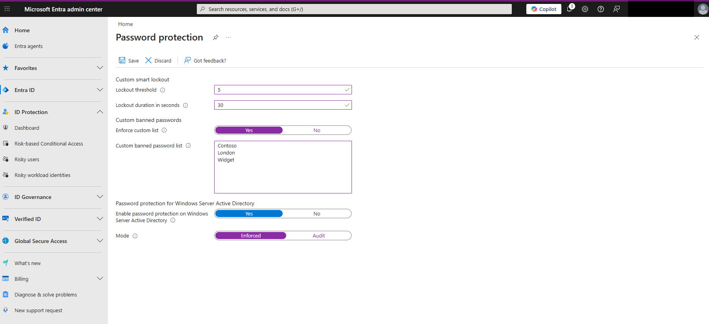
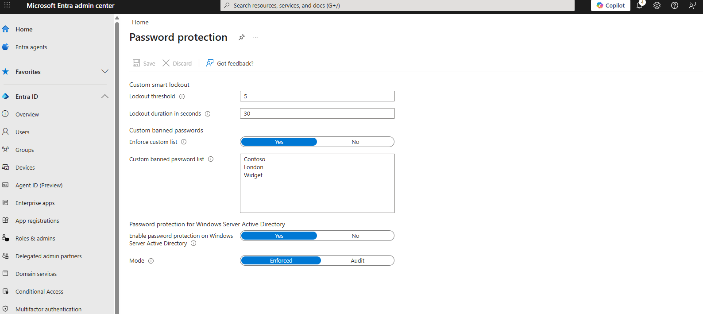

# Lab: Configuring Password Protection & Smart Lockout Policies

## Project Overview
In this lab, I implemented security guardrails within Microsoft Entra ID to protect against credential-based attacks. By configuring Smart Lockout thresholds and a Custom Banned Password list, I demonstrated how to harden the identity perimeter and prevent unauthorized access through automated brute-force or "password spraying" techniques.

* Tools Used: Microsoft Entra Admin Center.
* Key Focus: Credential Hardening, Brute-Force Prevention, and Identity Protection.

---

## Technical Execution

### 1. Custom Smart Lockout Configuration
* Task: Prevent automated login attempts by establishing account lockout triggers.
* Process: Configured the lockout threshold to 5 failed attempts and established a 30-second lockout duration. This ensures that malicious actors or automated scripts cannot continuously guess passwords without being temporarily blocked by the system.

### 2. Custom Banned Password Enforcement
* Task: Prohibit the use of high-risk, easily guessable passwords based on organizational context.
* Process: Enabled the "Enforce custom list" feature and defined a list of banned terms (e.g., Contoso, London, Widget). 
* Implementation: Set the protection mode to "Enforced" to ensure that no user can utilize these forbidden keywords as part of their password, significantly reducing the success rate of targeted dictionary attacks.

---

## Security Analysis & Best Practices

* Mitigating Password Spraying: By banning company-related terms such as "Contoso" or "Widget," I eliminated common patterns used in password-spraying attacks. Attackers often target users by testing common variations of the company name or location; this control proactively blocks that attack vector.
* Operational Resilience: Microsoft Entra’s Smart Lockout is designed to distinguish between a legitimate user who forgot their password and an external attacker. By setting these specific thresholds, I am hardening the identity perimeter without causing excessive lockouts for authorized personnel.
* Zero Trust Methodology: This lab aligns with the Zero Trust principle of "Assume Breach." By assuming passwords are a target, I have proactively enforced restrictions that make credentials more resilient to compromise.

---

## Evidence of Completion
> [!NOTE]  
> All sensitive Tenant data has been redacted to maintain Operational Security.

### Smart Lockout & Banned Password Settings

### Custom Banned Password List Configuration

---

## Learning Credits
This lab is based on the Microsoft Learn module: Configure Microsoft Entra Password Protection.
